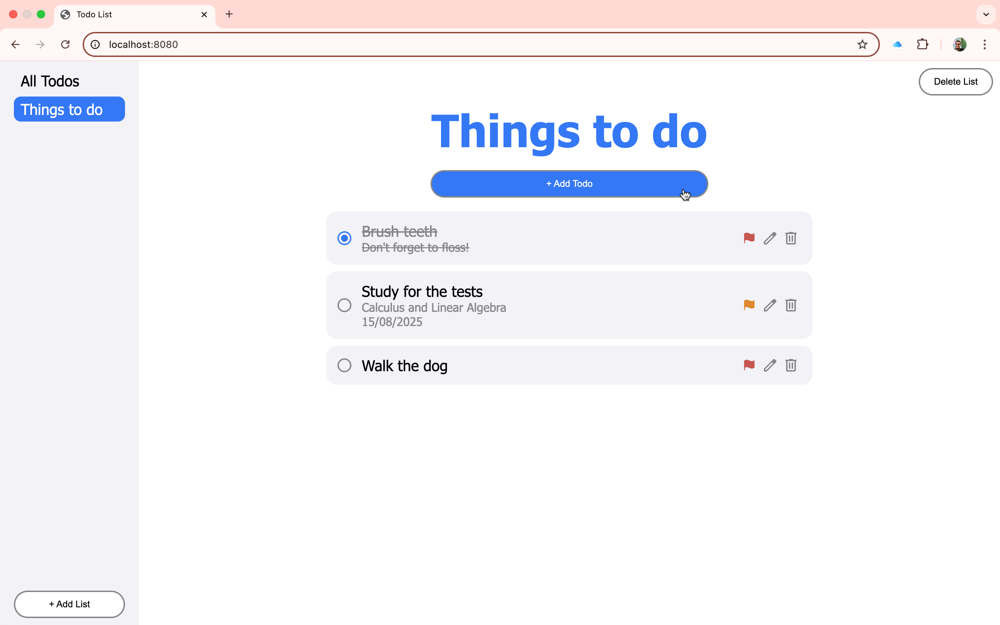

# todo-list

This project is a classic todo app. You can see the project live at https://lucasbpaiva.github.io/todo-list/

To add a new todo first create a new list using the button at the left corner, in the new list created the button for adding new todo items will be available.

In this project I was able to practice many things such as using external libraries like date-fns and Bootstrap and organizing code in different modules and functions. It was also my first time using local storage so that in this app the user data persists even after reloading the page or leaving the browser.